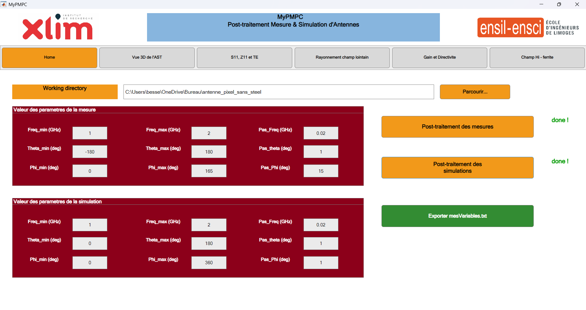
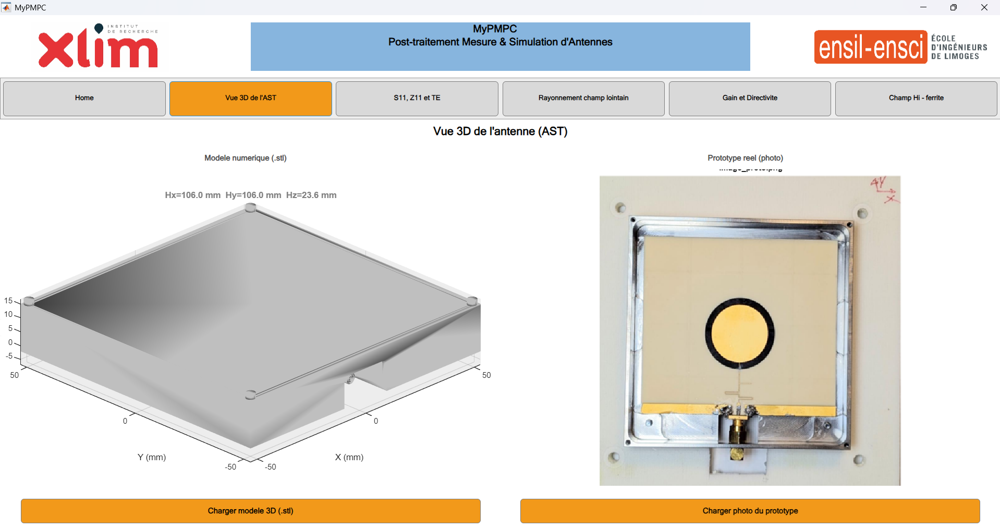
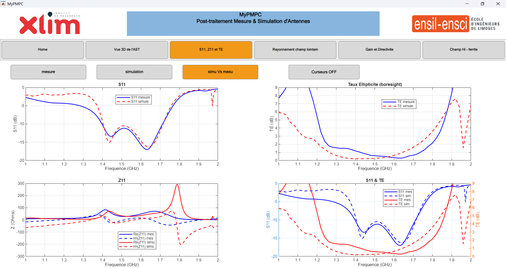
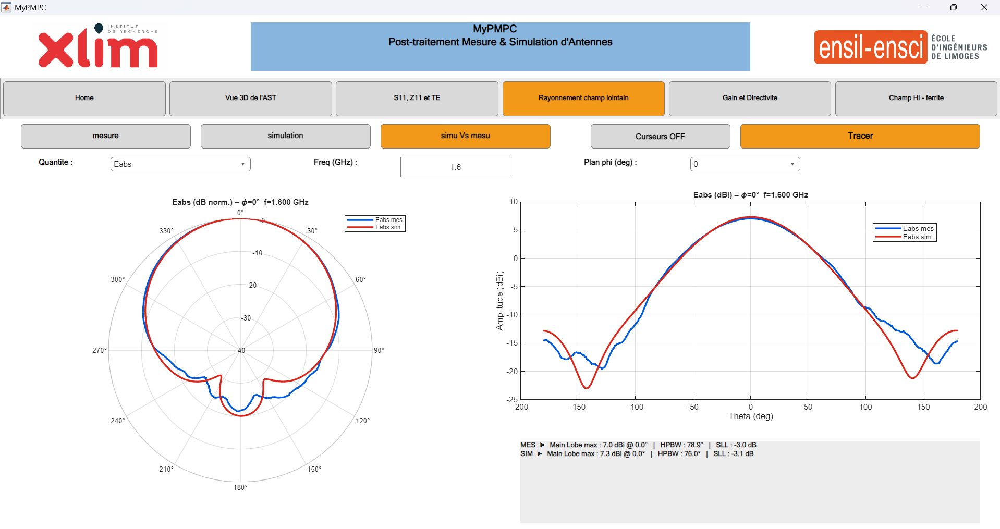
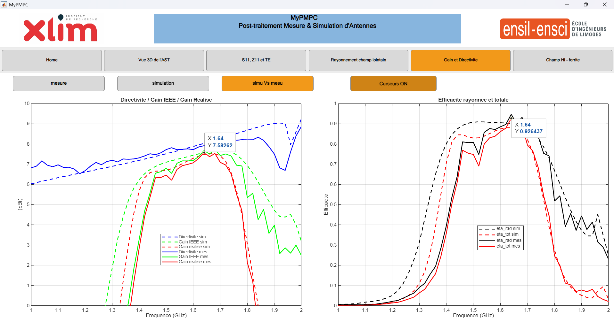
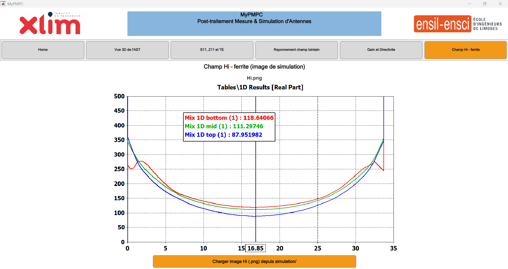

# MyPMPC — Post-traitement Mesure & Simulation d'Antennes

Application MATLAB pour la comparaison mesure/simulation d'antennes développée à XLIM.

---

## Utilisation

1. Lancer `MyPMPC.m` sous MATLAB R2021b ou supérieur
2. Sélectionner le working directory contenant `mesure/` et `simulation/`
3. Cliquer sur **Post-traitement des mesures** puis **Post-traitement des simulations**

---

## Structure attendue du répertoire

```
working_dir/
├── mesure/
│   ├── Ehoriz/   (*.amp, *.pha)
│   ├── Evert/    (*.amp, *.pha)
│   └── *.s2p
└── simulation/
    ├── Farfield/ (*.ffs)
    ├── *.stl
    ├── s11.s1p
    └── Hi.png
```

---

## Auteur

**Bessel AÏNA** — Étudiant en 5ᵉ année à l'ENSIL-ENSCI, Université de Limoges

---

## Annexe – Interface de l'application MyPMPC

Les captures d'écran ci-dessous illustrent les six onglets de l'application MATLAB MyPMPC.

---

### Onglet 1 – Home
**Sélection du répertoire de travail et chargement des données**



---

### Onglet 2 – Vue 3D AST
**Affichage du maillage `.stl` de l'antenne simulée**



---

### Onglet 3 – S11 / Z11 / TE
**Comparaison mesure/simulation du S₁₁ et du taux d'ellipticité**



---

### Onglet 4 – Rayonnement champ lointain
**Diagrammes 2D mesurés et simulés**



---

### Onglet 5 – Gain et Directivité
**Courbes fréquentielles G_R, G_IEEE, D, η_rad, η_tot**



---

### Onglet 6 – Champ Hi – ferrite
**Carte du champ magnétique interne**


